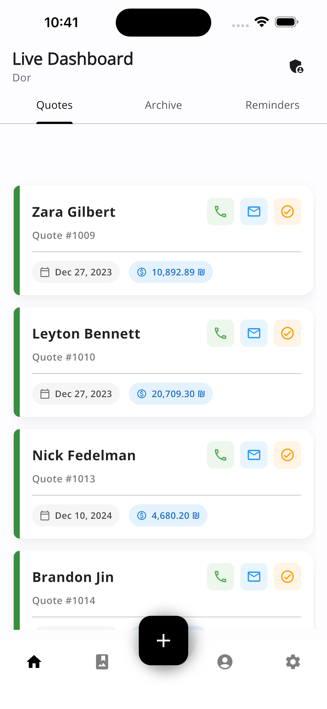
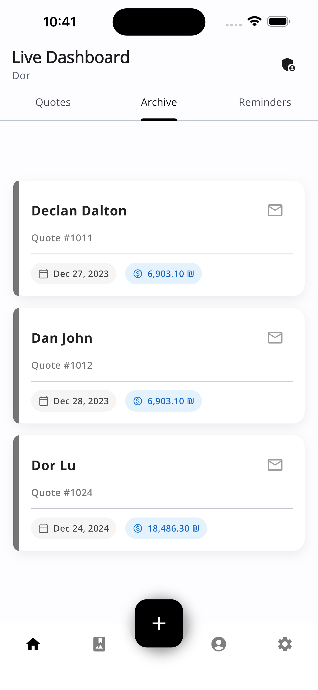
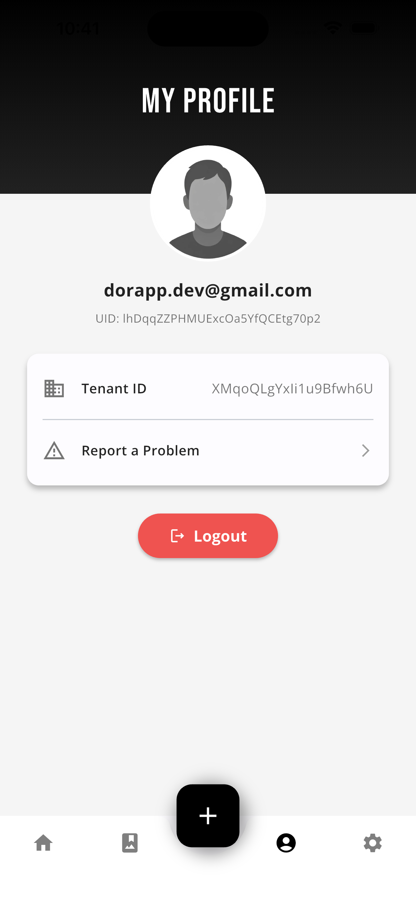
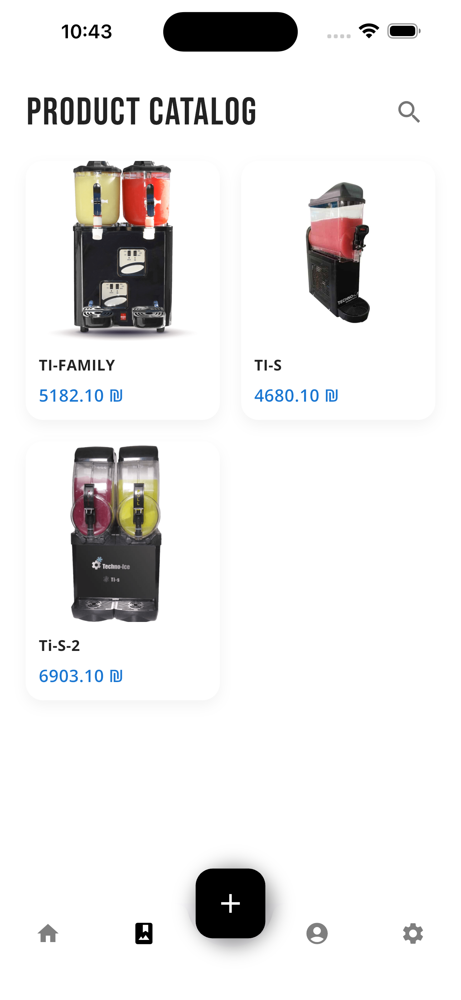
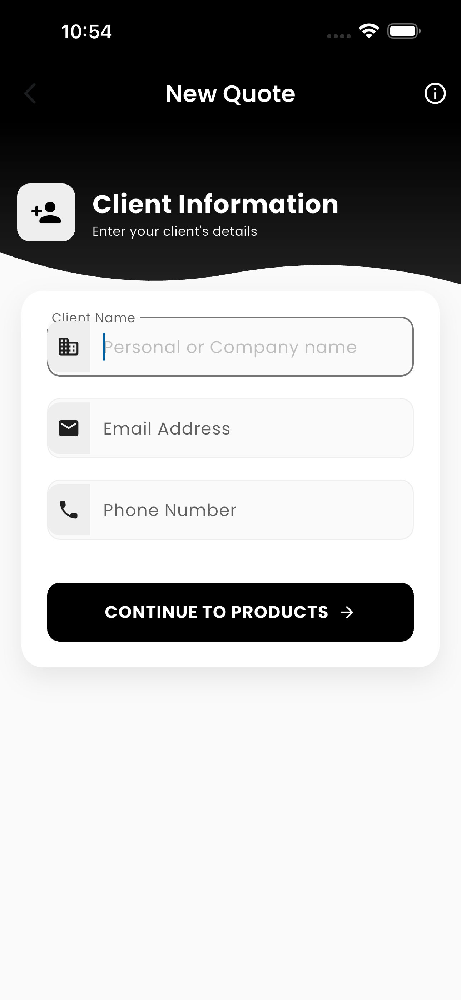
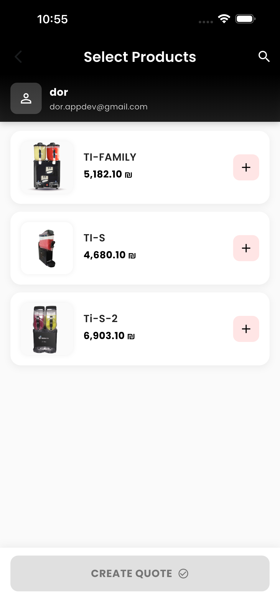
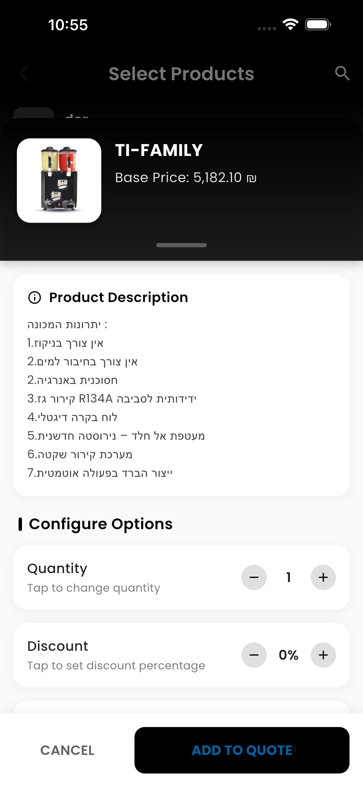

# QuoteApp (V3.0.0)

QuoteApp is a Flutter Cross Platform project that allows users to send quotes via email or SMS. It features a user-friendly admin panel, authentication, and cloud-based functionalities.

---

## ✅✅✅ Update (25.12.2024): new UI 🚀🚀🚀

Create, manage, and send professional quotes with ease—right from your phone.

---

# QuoteApp (V2.0.0)

✅✅✅ **Update (31.12.2023):** Production Ready 🚀🚀🚀

### 🎥 Demos:
◉ **Admin Panel Demo:** [Watch on YouTube](https://www.youtube.com/watch?v=0zgNTF5M7XM)

---

### 🔗 Project Links:
📱 **Customer Link Example:**  
[Demo Link](https://lproject-a1460.web.app/?tenant=XMqoQLgYxIi1u9Bfwh6U&bid=W4YF7XTn2ar9oqBROf2a&creator=lhDqqZZPHMUExcOa5YfQCEtg70p2)

🧑‍💻 **Source Code:**  
[BidClient on GitHub](https://github.com/DorDorel/bid-client)

---

### 🛠️ Technologies Used:
- **Authentication & Storage:** Firebase  
- **Serverless Backend:** Firebase Cloud Functions (Node.js v14)  
- **Databases:** Firebase Firestore (NoSQL), Hive (Local NoSQL)  
- **State Architecture & DI:** Provider (v6.0)

---

### 🚀 How to Use:
1. Initialize a new Firebase project using Firebase CLI.  
   [Firebase Setup Instructions](https://firebase.google.com/docs/flutter/setup?platform=ios)
2. Manually create the first tenant and first user in the Firestore project.  
   - *Note:* For multi-tenant management, consider building a web application for tenant management with Firestore integration.

---

### 🤝 Contributing:
We welcome contributions to BidApp!  
Please read our contribution guidelines for more information.

---

### 📬 Contact:
For any queries or feedback, reach out to us at  
📧 **dor.appdev@gmail.com**

---

### 🪪 License:
BidApp is released under **GPL-2.0**.
